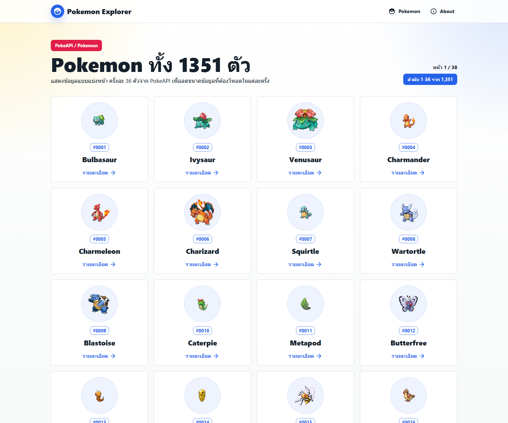
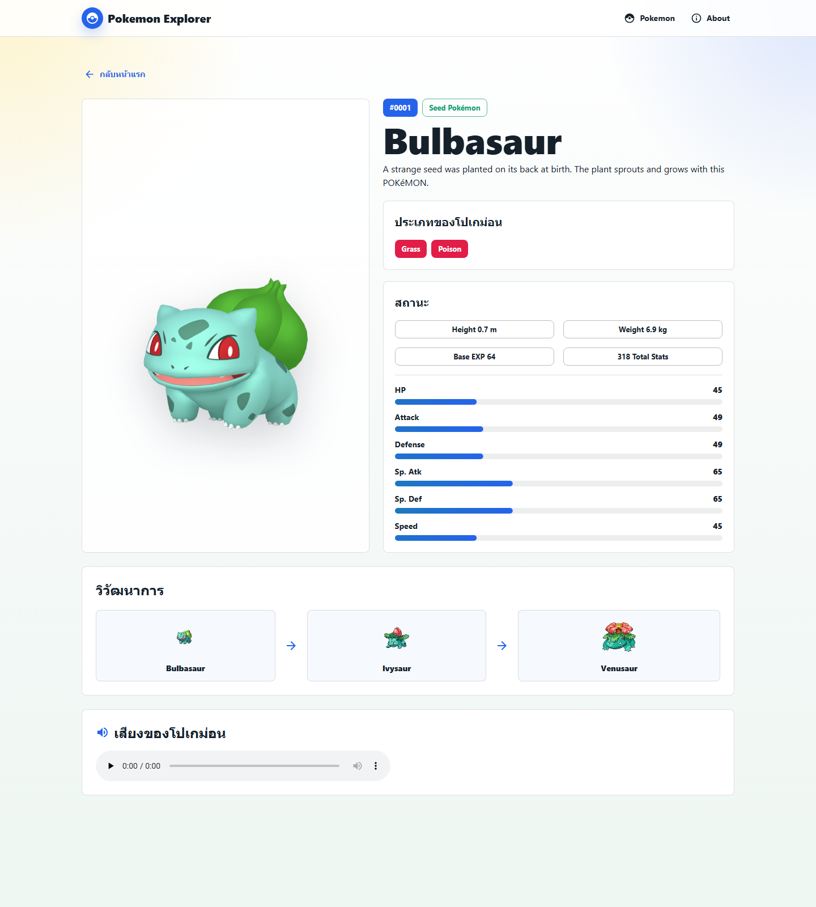
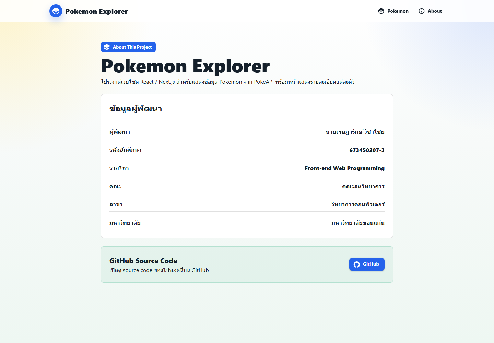

# Lab Pokemon Jesssadaruk

เว็บไซต์ Pokemon Explorer สำหรับแสดงข้อมูล Pokemon จาก PokeAPI โดยพัฒนาด้วย Next.js, React, TypeScript และ Material UI

## ข้อมูลผู้พัฒนา

- ชื่อผู้พัฒนา: นายเจษฎารักษ์ วิชาไชย
- รหัสนักศึกษา: 673450207-3
- รายวิชา: Front-end Web Programming
- คณะ: คณะสหวิทยาการ
- สาขา: วิทยาการคอมพิวเตอร์
- มหาวิทยาลัย: ขอนแก่น

## คำอธิบายโปรเจค

โปรเจคนี้เป็นเว็บแอปสำหรับค้นดูข้อมูล Pokemon ทั้ง 1351 ตัวจาก API `https://pokeapi.co/api/v2/` โดยหน้าแรกใช้เทคนิคการแบ่งหน้าในการดึงข้อมูล ครั้งละ 36 ตัว เพื่อลดปริมาณข้อมูลที่ต้องโหลดต่อครั้ง ผู้ใช้สามารถกดที่ Pokemon แต่ละตัวเพื่อดูรายละเอียดเพิ่มเติม เช่น ชื่อ รูปภาพ สถานะ วิวัฒนาการ ประเภท และเสียงของ Pokemon

## ฟังก์ชันหลักของโปรเจค

- แสดงรายการ Pokemon ทั้ง 1351 ตัวแบบแบ่งหน้า
- ใช้ Material UI Skeleton ระหว่างรอโหลดข้อมูลจาก API
- แสดงรูป Pokemon และหมายเลขประจำตัวในหน้าแรก
- เปิดหน้ารายละเอียดของ Pokemon แต่ละตัว
- แสดงข้อมูลรายละเอียด ได้แก่ ชื่อ รูปภาพ ประเภท สถานะ ค่าสเตตัส วิวัฒนาการ และเสียง
- มีหน้า About This Project แสดงข้อมูลผู้พัฒนาและลิงก์ GitHub Source Code
- ออกแบบหน้าเว็บให้รองรับหน้าจอ desktop และ mobile

## Screenshots

### หน้าแรก: รายการ Pokemon แบบแบ่งหน้า



### หน้ารายละเอียด Pokemon



### หน้า About This Project



## เทคโนโลยีที่ใช้

- Next.js
- React
- TypeScript
- Material UI
- PokeAPI

## วิธีติดตั้งและรันโปรเจค บน Locall

```bash
npm install
npm run dev
```

เปิดเว็บที่ http://localhost:3000

หรือเปิดผ่านออนไลน์ : https://lab-pokemon-jessadaruk.vercel.app/

## GitHub Source Code

https://github.com/Jessadaruk/Lab-Pokemon-Jessadaruk
